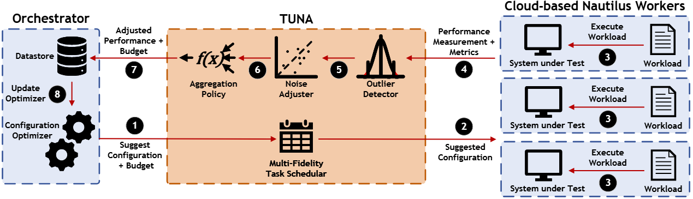

# TUNA: Tuning Unstable and Noisy Cloud Applications

This repository contains the source code used for "TUNA: <ins>T</ins>uning <ins>U</ins>nstable and <ins>C</ins>oisy Cloud <ins>A</ins>pplications" (to appear in [EuroSys'25](https://2025.eurosys.org/accepted-papers.html#pagetop)). TUNA is a sampling methodology that uses a few key insights to improve the quality of configurations found during system autotuning. In particular, TUNA uses
1. An *outlier detector* to prevent unstable configurations from being learned,
2. A *noise adjustor model* to provide a more stable signal to an optimizer to learn from, and
3. *Cost concious* *multi-fidelity* tuning to improve the rate of convergence.

This code can be used to run the main experimental results from our paper. Users interested in using these techniques can make small modifications to the scripts to integrate their own target systems, particularly in `nautilus`, or in `proxy/evaluation_server.py`.

## Fetching Code

To pull the code, we use a submodules for library dependencies. These commands should pull all the necessary code.

```sh
git clone git@github.com:uw-mad-dash/TUNA.git
git submodule update --init --recursive
```

## Source Code Structure

TUNA uses [MLOS](https://github.com/microsoft/MLOS) as it's base tuning framework, and implements a custom scheduling and sampling policy on top of it, and then selects tuners from those offered (we intend to incorporate them [upstream](https://github.com/microsoft/MLOS/issues/926) in time).
TUNA also uses [Nautilus](https://dl.acm.org/doi/pdf/10.1145/3650203.3663336) to manage and deploy the execution environment. The code here is a fork of a private library that will be released soon.

- `src`
  - `benchmarks`: Metric collection scripts
  - `client`: Orchestrator side scheduling policies
  - `MLOS`: The MLOS library. We used a specific branch that is no longer available on git, so we provide a fork that has an up to date version, with minor updates to keep it compatible with updated version of the libraries.
  - `nautilus`: Nautilus dependency. See [Paper](https://dl.acm.org/doi/pdf/10.1145/3650203.3663336).
  - `proto`: gRPC communication definition files
  - `proxy`: A worker sided proxy to forward incoming messages to nautilus
    - `executors`: worker side server to listen for incoming gRPC requests
    - `nautilus`: stub files for proper linting
  - `processing`: deployment and management scripts
  - `spaces`
    - `benchmark`: Workload definitions for nautilus
    - `dbms`: Database definitions for nautilus
    - `experiment`: Files defining how benchmarks, dbms, knobs, and params are combined
    - `knobs`: List of knob definitions
    - `params`: Machine characteristics


## Environment



The environment for TUNA requires two different types of nodes: an Orchestrator and a set of Workers. These two different types of nodes has slightly different setup instruction, found below.

All scripts are found in `src/processing`. One script that may be useful is `add_hosts.sh <hosts> <port>` as a way to add all of the hosts listed in the specified host file to the trusted hosts list. This is required for `pssh` which we use to deploy our scripts. One point of note is that you cannot have your username in the hosts file when using this script.

These scripts should work on any platform, however, we have only tested this on [Azure](https://portal.azure.com/), and [CloudLab](https://www.cloudlab.us/). We provide experiment files for `c220g5` nodes on CloudLab, and `D8s_v5` nodes in Azure. These instance types will become important later, however users can provide their own files in `./src/spaces`.

If you are trying to replicate the work found in our paper, we recommend using 10 worker nodes and 1 orchestrator node, where the 10 worker nodes are the first 10 nodes that were created. This will allow you to use our provided hosts files (`hosts.azure` or `hosts.cloudlab`). Alternatively, a custom host file can be used.

### Workers

To install and copy our files, there are two commands we will need to run.

- `./worker_setup_remote.sh <hosts>`

The first command will install all of the dependencies, as well as set up the environment.

`./worker_deployment.sh <hosts> <node_type>`

The second command will start all of the required processes. Note that the second command will say some of the commands fail. This is expected, as they simply ensure that any previous instances of stopped and deleted before beginning the initialization process.

At some point during running this command, there will be a required interaction to specify that the docker image that is building in the background has completed. There are two options here. First, you can connect to one of the workers and run `sudo tmux a -t install`, and sure that the pane has completed all of its commands. Alternatively, you can wait around 20 minutes, and this will most likely be long enough for the image to complete building.

### Orchestrator

Building the orchestrator is requires slightly more interaction from the user. 

`bash orchestrator_deploy.sh <orchestrator_host> 22`

First, like before we will set up the environment using a deployment script. This will, again, automate the file transfer and environment setup.

Next, connect to your orchestrator node and run the following commands. Note, that the first command is `tmux`. We recommend using this as tuning runs are long running. Without `tmux` disconnects are common over `ssh`, however this is not technically required.

```sh
tmux
```

```sh
cd src/MLOS ; make
cd ..
conda activate mlos
```

## Usage Examples

To test functionality of TUNA, there is one main script that can be run on the orchestartor node:

```sh
python3 TUNA.py <experiment> <seed> <hosts>
```

An example of this with the parameters filled out the way we used it in the paper is as follows:

```sh
python3 TUNA.py spaces/experiment/pg16.1-tpcc-8c32m.json 1 hosts.cloudlab
```

Running this command will run a tuning run for around 8 hours. The results will be output into the results folder in .csv and .pickle file formats. These can then be rerun using `mass_reruns_v2.py`, however this is not required to get tuning results.

## Description of tuning scripts

Here we provide a brief description of each tuning script. All of the following scripts are run with the following general pattern `python3 <script> <experiment> <seed> <hosts>`, with the exception of `parallel_prior.py` which takes an additional noise command at the end of the script. An example is included in the next section.

- `mass_reruns_v2.py`: A script to rerun selected configurations for the "inference" step as described in the paper.
- `naive_measured.py`: A script to run our naive distributed tuning setup, where every configuration is run on each node. This is the script we used in our ablation study.
- `parallel_gp.py`: A script to run traditional sampling, with a gaussian process model.
- `parallel_prior.py`: A script to run traditional sampling with injected gaussian noise determined by the noise level. This script is run as follows: `python3 parallel_prior.py <experiment> <seed> <hosts> <noise>`
- `parallel.py`: A script to run the default traditional sampling baseline as described in the paper.
- `TUNA_gp.py`: A script to run TUNA with the optimizer switched out for a gaussian process model
- `TUNA_no_model.py`:The full TUNA sampling methodology without the noise adjustor model.
- `TUNA_no_outlier.py`: The full TUNA sampling methodology without the outlier detection.
- `TUNA.py`: The normal TUNA sampling script that is used throughout the paper.

### Scripts used for Reproducing Selected Experiments

|           | Description                                                                                                                                                                                                                 | Estimated Azure Cost | Tuning Commands                                                                                                                                                                                                       |
|-----------|-----------------------------------------------------------------------------------------------------------------------------------------------------------------------------------------------------------------------------|----------------------|-----------------------------------------------------------------------------------------------------------------------------------------------------------------------------------------------------------------------|
| Figure 3  | Run parallel tuning runs with a gaussian prior. This is used to compare the rate of convergence in a noisy environment.                                                                                                     | N/A                  | `python3 parallel_prior.py spaces/experiment/pg16.1-epinions-c220g5.json <seed> <hosts> <noise>`                                                                                                                      |
| Figure 9a | Run 10 parallel tuning runs, and 10 runs using TUNA targeting the TPC-C workload on Postgres 16.1 running on Azure. Take the data that is generated from this output and rerun the data on a set of 10 new worker nodes.    | $320                 | `python3 parallel.py spaces/experiment/pg16.1-tpcc-8c32m.json <seed> <hosts>`<br /> `python3 TUNA.py spaces/experiment/pg16.1-tpcc-8c32m.json <seed> <hosts>`  <br /> `python3 mass_reruns_v2.py`                     |
| Figure 9b | Run 10 parallel tuning runs, and 10 runs using TUNA targeting the epinions workload on Postgres 16.1 running on Azure. Take the data that is generated from this output and rerun the data on a set of 10 new worker nodes. | $320                 | `python3 parallel.py spaces/experiment/pg16.1-epinions-8c32m.json <seed> <hosts>`<br /> `python3 TUNA.py spaces/experiment/pg16.1-epinions-8c32m.json <seed> <hosts>`  <br /> `python3 mass_reruns_v2.py`             |
| Figure 9c | Run 10 parallel tuning runs, and 10 runs using TUNA targeting the TPC-H workload on Postgres 16.1 running on Azure. Take the data that is generated from this output and rerun the data on a set of 10 new worker nodes.on  | $320                 | `python3 parallel.py spaces/experiment/pg16.1-tpch-8c32m.json <seed> <hosts>`<br /> `python3 TUNA.py spaces/experiment/pg16.1-tpch-8c32m.json <seed> <hosts>`  <br /> `python3 mass_reruns_v2.py`                     |
| Figure 10 | Identical to Figure 9a, however running on a different region.                                                                                                                                                              | $320                 | `python3 parallel.py spaces/experiment/pg16.1-tpcc-8c32m.json <seed> <hosts>`<br /> `python3 TUNA.py spaces/experiment/pg16.1-tpcc-8c32m.json <seed> <hosts>`  <br /> `python3 mass_reruns_v2.py`                     |
| Figure 11 | Identical to Figure 9a, however running on CloudLab `c220g5` nodes rather than on Azure.                                                                                                                                    | N/A                  | `python3 parallel.py spaces/experiment/pg16.1-tpcc-c220g5.json <seed> <hosts>`<br /> `python3 TUNA.py spaces/experiment/pg16.1-tpcc-c220g5.json <seed> <hosts>`  <br /> `python3 mass_reruns_v2.py`                   |
| Figure 12 | Run 10 parallel tuning runs, and 10 runs using TUNA targeting the YCSB-C workload on redis running on Azure. Take the data that is generated from this output and rerun the data on a set of 10 new worker nodes.           | $320                 | `python3 parallel.py spaces/experiment/redis7.2-ycsb-8c32m-latency.json <seed> <hosts>`<br /> `python3 TUNA.py spaces/experiment/redis7.2-ycsb-8c32m-latency.json <seed> <hosts>`  <br /> `python3 mass_reruns_v2.py` |
| Figure 14 | Identical to Figure 9a, however using a gaussian process optimizer rather than a random forest optimizer (SMAC).                                                                                                            | $320                 | `python3 parallel_gp.py spaces/experiment/pg16.1-tpcc-8c32m.json <seed> <hosts>`<br /> `python3 TUNA_gp.py spaces/experiment/pg16.1-tpcc-8c32m.json <seed> <hosts>`  <br /> `python3 mass_reruns_v2.py`               |
| Figure 16 | Identical to Figure 9a, with the outlier detector ablated.                                                                                                                                                                  | $1400                | `python3 TUNA.py spaces/experiment/pg16.1-epinions-8c32m.json <seed> <hosts>`<br /> `python3 TUNA_no_model.py spaces/experiment/pg16.1-epinions-8c32m.json <seed> <hosts>`  <br />                                    |
